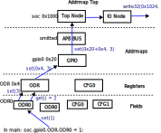

# PeakRDL-halcpp

## Description

PeakRDL-halcpp is a generator for hardware abstraction layer for peripherals that enables low-level interaction with hardware. </br>
It is based on C++ 17, and is using some of the concepts like SFINAE, Mixins, static polymorphism... </br>
The architecture is based on a model of static template classes representing registers, fields, and address maps. </br>

The primary goal of the project is to provide enhanced flexibility and code readability while ensuring that the size and performance of the compiled code remain equivalent to the C-based driver.

### Assignment and conversion operators

In order for easing the use of the drivers, registers and fields have overloaded assignment, conversion operators, in order to allow code like this:
```
soc.gpio0.ODR = 0xff;
uint32_t in_data = soc.gpio0.IDR;
```

### Constants and enumerations

Provided also is a Const data type providing compile time constants. Toghether with custom enum classes, it is possible to write code like this, concatenation inspired by Verilog
```
soc.gpio0.CFG0 = (pincfg::IN, pincfg::OUT, pincfg::OUT_PP, pincfg::OUT_OD);
```
In this case there is a overloaded , (comma) operator for Const data type, allowing concatenation of compile time constants. </br>
In the previous code **pincfg** is a class defining enums, while **IN** (input), **OUT** (output), **OUT_PP** (output push pull), **OUT_OD** (output open drain) provide possible options for the field of the CFG0 register. </br>

In previous case CFG0 is a 24-bit register and pincfg is a 3-bit enum, so the total number of bits in the concatenation will amount to 12, this will cause a compilation error. </br>
It is by default strongly typed and does not allow width missmatch. To solve this in previous example, it is neccessary to pad the list with Const, like this:

```
soc.gpio0.CFG0 = (Const<12, 0>(), pincfg::IN, pincfg::OUT, pincfg::OUT_PP, pincfg::OUT_OD);
```
Const is the template that the other enums are built from, and its parameters are *Const<WIDTH, VAL>*

### Hierarchy of the driver

The graph depicted presents the driver's architecture.</br> 
Consider an operation where main() sets a value in field ODR0. </br>

This triggers the operator=, which calls the set() static function in FieldWrMixin that provides write functionality to FieldNode. </br>
FieldNode then calls the get() method of the parent type, if present. If not, it will call set(1).. If it exists, it takes the return value and applies a mask, sets its range in the register field, and then calls set with the calculated value. </br>

The set() method of the parent node will be called from the register. For RegNode type, the parent node is AddrmapNode type. </br>

From the addrmap node, the parent node can be another AddrmapNode or void. If it's void, it means that this node is the top node and should implement memory or emulator IO functionality. </br>
This can be achieved by either inheriting from provided ArchIoNode or writing a custom one. </br>
By separating IO operations in this way, it becomes easier to reuse the driver in different environments. For instance, in a SystemC-UVM verification of the peripheral, IO reads and writes would be methods that construct a uvm_sequence_item and send it to the driver. </br>



### Extending HAL classes

Extending the Addrmap class with user-defined methods is possible. </br>
In order for the tool to integrate this extended class, it is neccessary to provide the name of the class that has extension, during invokation of the exporter or through peakrdl command line argument. </br>
The extended library should be in a file named \<name\>_ext.h, and the name of the class must be \<NAME\>. </br>
For instance, for apb_gpio, the file would be apb_gpio_ext.h, and the name of the class would be APB_GPIO. </br>

The class needs to be a template with the following signature `template<uint32_t BASE, typename PARENT_TYPE=void>` .
This way the base address of the Addrmap can be set, and `PARENT_TYPE` can either be void for the top node, or some other class at time of specialization. </br>
Specializations of `PARENT_TYPE=void` will inherit the default ArchIoNode class by default. </br>
The new template class should also inherit `APB_GPIO_HAL<BASE, PARENT_TYPE>` while forwarding the template arguments. </br>
In the extended class, the registers and fields of the HAL class should be used to implement a higher-level interface to the peripheral. </br>

Here's an example:
```
#include "apb_gpio_hal.h"
#include <cstdint>

template<uint32_t BASE, typename PARENT_TYPE=void>
class APB_GPIO : public APB_GPIO_HAL<BASE, PARENT_TYPE> {
public:
  void write_pin(uint16_t pin, bool level) {
      if(level)
          this->BSRR = 1 << pin;
      else
          this->BSRR = 1 << pin << 16;
  }

  APB_GPIO() {}
};

```

## Getting Started

### Installation

To install peakrdl-halcpp follow the steps:

```
git clone https://github.com/Risto97/PeakRDL-halcpp.git
cd PeakRDL-halcpp
pip install -e .
```
This will allow you to use halcpp through the peakrdl interface. </br>

### Usage

#### Peakrdl

In order to generate files through peakrdl interface run the follwoing command:
```
peakrdl halcpp examples/atxmega_spi.rdl -o out_hal 
```
The files will be generated in out_hal directory </br>

#### Python script

Another way to use is to create a python script, like the one in `examples/export.py`

```
from systemrdl import RDLCompiler
from peakrdl_halcpp import HalExporter

rdlc = RDLCompiler()
rdlc.compile_file("atxmega_spi.rdl")

root = rdlc.elaborate()
top_gen = root.children(unroll=True)

top = None
for top in top_gen:
    top = top
assert top is not None

exporter = HalExporter()

exporter.export(
        nodes=top,
        outdir="generated",
        )
```
